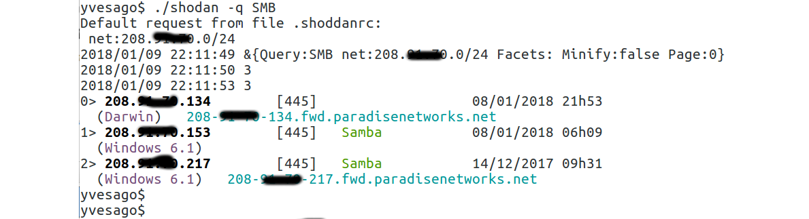
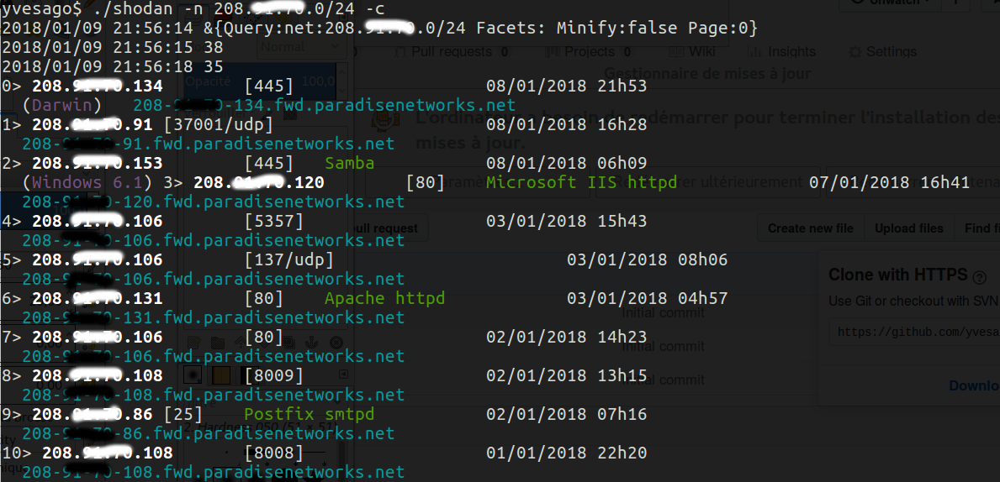

# shodan-cli


Simple golang Shodan command line client with default query.


## Usage

To start working with Shodan you need an API key. You can do this at [https://www.shodan.io](https://www.shodan.io).

Use the API key in `$SHODAN_KEY` environment variable.


```bash
Usage of ./shodan-cli:
  -b	black & white, no color
  -c	compact, no detail
  -i string
    	ip [192.168.0.1]
  -n string
    	net [192.168.0.0/24]
  -q string
    	query ['!http']
```

On first call `shodan-cli` will ask an optional default query stored in `.shoddanrc`.


### Query sample



### IP query sample


### Network query sample



## Build

```bash

$ go get gopkg.in/ns3777k/go-shodan.v2/shodan
$ go get github.com/logrusorgru/aurora

$ go build

```

As usual, you can build executables for multiple platforms :
```bash

$ # linux 32 bits
$ GOARCH=386 go build -ldflags "-s" -o shodan-cli32

$ # windows 32 bits
$ GOOS=windows GOARCH=386 go build  -ldflags "-s" -o shodan-cli32.exe

$ # OsX
$ GOOS=darwin go build -ldflags "-s" -o shodan-cliOsX

```


## Links
* [Shodan.io](http://shodan.io)
* [Golang Shoddan API](http://github.com/ns3777k/go-shodan)


## Licence

MIT License

Copyright (c) 2018 Yves Agostini

<yves+github@yvesago.net>
